```mermaid
graph LR
  Dev["Developer Machine"]
  Repo["Git Repository"]
  Clone["Run `git clone`"]
  Env["Copy/edit `.env` file"]
  Secrets["Fill secrets (DOMAIN, API tokens, etc.)"]
  Push["Push to `main`"]
  CI["GitHub Actions CI"]
  Build["Build & publish Docker image to GHCR"]
  Runner["Self-hosted Runner (on VPS)"]
  Deploy["`docker compose up -d`"]
  Stack["Running stack on VPS"]
  Browser["Access via browser (e.g. ${DOMAIN})"]

  Dev --> Repo
  Repo --> Clone
  Clone --> Env
  Env --> Secrets
  Secrets --> Push
  Push --> CI
  CI --> Build
  Build --> Runner
  Runner --> Deploy
  Deploy --> Stack
  Stack --> Browser
```

## Getting Started

First, clone the repo and install dependencies.

```bash
git clone https://github.com/tabeeb09/oi.loftrop.com.git
cd oi.loftrop.com
npm install
```

To run only the Next.js app in local development:

```bash
npm run dev
```

Open [http://localhost:3000](http://localhost:3000) with your browser to see the result.

I am running this on a VPS, so allowing it to be accessible via the internet. You can access my portfolio site by nativating to https://oi.loftrop.com which is portfolio spelled in reverse order.
Every Time I push commit to the main branch, the VPS is confgiured with Github Actions and the new version of the site goes live. If any content is needed for the site that is too large for GitHub,
I use google cloud content servers, so those files will not be provided in this repo. Note that sensitive things such as api keys and my Personal details such as my CV are not included.

## Environment and secrets

For a full local or VPS-style run, create the base env file and then let the bootstrap script fetch runtime secrets from OpenBao.

```bash
cp .env.example .env
# fill in hostnames, URLs, and any local overrides you need
```

If you are testing the full same-host stack locally, the generated runtime file is assembled with:

```bash
npm run prepare:fullstack:local
```

If you are testing production-style env assembly from fetched secrets:

```bash
npm run prepare:fullstack:prod
```

The OpenBao bootstrap fetch is:

```bash
npm run fetch:openbao-secrets
```

You must provide your own values for domain names, OAuth provider credentials, OpenBao AppRole credentials, Keycloak client secrets, S3 credentials, and any DNS/provider API tokens used by the infrastructure scripts.

## Running the stack locally

If you only need the website UI:

```bash
npm run dev
```

If you want the full local stack with generated env assembly:

```bash
npm run prepare:fullstack:local
npm run up:fullstack:local
```

If you prefer Docker Compose directly for the website and RustFS:

```bash
docker compose -f docker-compose.rustfs.yaml up -d
docker compose -f docker-compose.full.yaml -f docker-compose.same-host-rustfs.yaml up -d
```

To stop them:

```bash
docker compose -f docker-compose.full.yaml -f docker-compose.same-host-rustfs.yaml down
docker compose -f docker-compose.rustfs.yaml down
```

## VPS stack scripts

Use the master script for normal VPS operations:

```bash
sudo bash scripts/website-stack-vps.sh setup
sudo bash scripts/website-stack-vps.sh deploy
sudo bash scripts/website-stack-vps.sh status
```

`setup` provisions host dependencies, checks out or updates the repo, prepares base configuration, bootstraps runtime secrets, deploys RustFS, and then deploys the website.

`deploy` redeploys the RustFS and website stacks and uploads registered site resources to S3.

`status` shows the current app and RustFS container state.

The lower-level scripts remain available for targeted operations:

```bash
sudo bash scripts/bootstrap-app-vps.sh
sudo bash scripts/deploy-rustfs-vps.sh
sudo bash scripts/deploy-app-vps.sh
```

Hierarchy:

- `website-stack-vps.sh` orchestrates the full website VPS flow.
- `bootstrap-app-vps.sh` fetches OpenBao secrets and writes deploy env files.
- `deploy-rustfs-vps.sh` starts RustFS, OAuth2 Proxy, and the media Caddy.
- `deploy-app-vps.sh` starts the Next.js website and website Caddy.

Useful operational commands:

```bash
sudo bash scripts/website-stack-vps.sh logs
sudo bash scripts/website-stack-vps.sh down
sudo docker compose -f docker-compose.full.yaml -f docker-compose.same-host-rustfs.yaml logs -f
sudo docker compose -f docker-compose.rustfs.yaml logs -f
```

## Admin access

After startup, the public website is served from your configured site URL.

The CMS is served from:

```text
https://<APP_HOST>/cms/media
```

The RustFS admin surface is normally fronted through the RustFS admin host:

```text
https://<RUSTFS_ADMIN_HOST>
```

The OAuth2 Proxy callback host is configured through:

```text
https://<OAUTH2_PROXY_HOST>
```

The site expects Keycloak and OpenBao to be bootstrapped already. In the intended flow, those services are provisioned from the CAId repo, not manually inside this repo.

## Resource registry

Static portfolio assets are registered in the internal translation layer at:

```text
src/lib/resource-schema-data.json
```

That file is intentionally internal. It maps stable resource identifiers to object keys so the storage backend can be changed later without rewriting page-level references.

To upload all registered assets and paper bundles into RustFS/S3:

```bash
npm run upload:resources
```

To add a new asset or report, add it to the repo, register it in `src/lib/resource-schema-data.json`, and then re-run the upload command or a normal VPS deploy.

## Hetzner bootstrap

If you are using the single-VPS Hetzner bootstrap path:

```powershell
.\scripts\bootstrap-hetzner-project.ps1 --config .\my-bootstrap.config.json
```

If the config file does not exist yet, create it first from the example and fill in your values:

```powershell
Copy-Item .\infra\hetzner-single\bootstrap.config.example.json .\my-bootstrap.config.json
```

The bootstrap path expects your own Hetzner API token, Cloudflare API token when DNS automation is enabled, GitHub token for runner/repo configuration, domain names, and external OAuth credentials.

## GitHub Actions deployment

The deployment flow is:



The deployment flow is:

```text
push to main
-> Build and Push Website
-> ghcr.io/tabeeb09/website:latest
-> App Deploy To VPS
-> scripts/website-stack-vps.sh bootstrap
-> scripts/website-stack-vps.sh app
```

Automatic deploys from `Build and Push Website` restart only the website app stack. They do not restart RustFS. Manual `workflow_dispatch` supports `deploy_scope=app`, `deploy_scope=full`, `deploy_scope=rustfs`, or `deploy_scope=status`.

Required repository secrets:

```text
DEPLOY_HOST
DEPLOY_USER
DEPLOY_SSH_PRIVATE_KEY or DEPLOY_SSH_PRIVATE_KEY_B64
DEPLOY_SSH_KNOWN_HOSTS or DEPLOY_SSH_KNOWN_HOSTS_B64
```

Optional repository variables:

```text
DEPLOY_PORT=22
USE_LOCAL_RUSTFS_NETWORK=true
APP_EXTRA_COMPOSE_FILES=
RUSTFS_EXTRA_COMPOSE_FILES=
```

Generate the deploy SSH key and known-hosts value from a local machine:

```powershell
.\scripts\prepare-github-actions-vps-deploy.ps1 -HostName your-vps-hostname -UserName deploy -InstallPublicKey
```

For a non-standard SSH port:

```powershell
.\scripts\prepare-github-actions-vps-deploy.ps1 -HostName your-vps-hostname -UserName deploy -Port 2222 -InstallPublicKey
```

For the current same-VM dev setup, the optional override variables are useful. Production should normally leave them empty unless a host needs local-only compose overrides.

## Checks

Local checks currently supported by the repo:

```bash
npm run build
npm run lint
```
